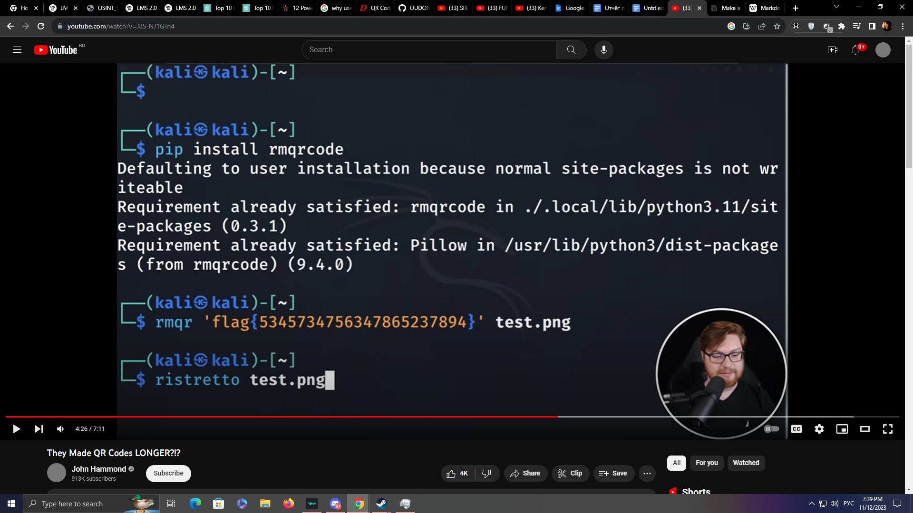

# Общая информация

**Название RU:** Отсканируете?

**Название EN:** Can you scan it?

**Сложность:** Easy

**Ответ:** {Now I know that rMQR exists! And this is my final answer.}

**Автор:** Шедогубов Н.И. (263938)

**Дата:** 12.11.2023

# Текст задания RU
Но с каких пор он такой.. вытянутый? Отсканируйте QR* код для получения флага.

# Текст задания EN
But since when is it so.. stretched? Scan the QR*-code to get the flag!

# Решение
Пользователь пробует отсканировать rMQR, этого сделать не получается

Пользователь идёт искать информацию по "длинному qr коду", можно на этом шаге при необходимости предложить подсказку "long qr code", данный запрос в кавычках как в google, так и на youtube поможет найти видео на тему таких вытянутых QR (https://www.youtube.com/watch?v=J8S-NJ1GTn4)

Пользователь просмотрев видео поймёт что это и как этим пользоваться, а также как отсканировать их

Пользователь скачает приложение QRQR DENSO WAVE (https://www.denso-wave.com/en/system/qr/product/reader.html) Только оно способно отсканировать rMQR

